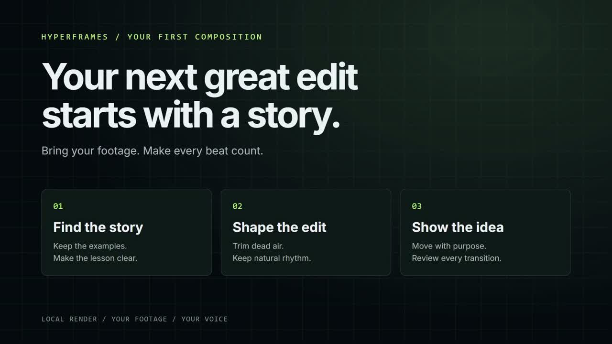

# HyperFrames Video Pipeline



Nate Herk's reusable video-editing kit for **Codex and Claude Code**.
Bring your own footage. Cut dead air, review mistakes, plan the story, and build
motion graphics with HyperFrames and GSAP.

- **10 complete skills**, mirrored for both assistants, with their helper scripts and references.
- **406 draft motion-graphics cards** across two styles, with manifests, CSS tokens, and editable slots.
- **Two scene templates:** dark graph paper and a left glass popout.
- Transcription, silence cutting, mistake detection, reviewed cut rendering,
  transcript retiming, EDL review, beat-sync validation, and preflight tools.
- A synthetic starter composition and editing fixture that need no footage or API key.

## Install

Install Node.js **22 or newer**, Git, FFmpeg (including ffprobe), and Chrome or
Chromium. Make `node`, `ffmpeg`, and `ffprobe` available in your terminal.
Then run these commands in PowerShell, macOS Terminal, or a Linux shell:

```sh
git clone https://github.com/nateherkai/hyperframes-video-pipeline.git
cd hyperframes-video-pipeline
npm ci
npm run setup
npm test
```

Setup checks the tools and creates `.env` only if it is absent. For your own
recordings, add an ElevenLabs API key with `speech_to_text` access to that local
file. Transcription uploads audio and uses your ElevenLabs credits. Everything
else in the starter runs locally. [Setup and troubleshooting](docs/SETUP.md).

## Render your first example

```sh
npm run demo
cd video-projects/demo
npx hyperframes lint
npx hyperframes preview
```

Scrub the eight-second animation in Studio. After reviewing it, stop the preview
with Ctrl+C, then render:

```sh
npx hyperframes render --quality draft --output renders/demo.mp4
```

The demo uses local GSAP. HyperFrames may download and cache its font substitutions on the first render. It has no voiceover. The separate
[synthetic transcript](examples/editing/source.json) exercises the cutting tools;
it is fictional test data, not a transcript of the title animation.

## Edit your footage

Open this repository folder in Codex or Claude Code and say:

> Use edit-video to edit my recording at [local path]. Keep my examples and core
> lessons. Tighten dead air, show me the proposed mistake cuts, and use the dark
> graph-paper style with occasional glass cards. Produce a reviewed draft.

Codex: `$edit-video`. Claude Code: `/edit-video`. For a single operation use
`cut-silences`, `cut-mistakes`, `video-storytelling`, or `style-library`.
See the [step-by-step workflow](docs/WORKFLOW.md), [prompt recipes](docs/PROMPTS.md),
and [storytelling workbook](docs/STORYTELLING-WORKBOOK.md).

## Explore and customize

| Resource | Start here |
| --- | --- |
| Shared agent instructions | [AGENTS.md](AGENTS.md) |
| Motion and transition vocabulary | [MOTION_PHILOSOPHY.md](MOTION_PHILOSOPHY.md) |
| Card library and design tokens | [Library guide](style-library/GUIDE.md) |
| Searchable card metadata | [registry.json](style-library/registry.json) |
| Whole-scene templates | [Template guide](style-templates/README.md) |
| Codex setup and mirroring | [.codex/README.md](.codex/README.md) |
| Release checks and limits | [Verification](docs/VERIFICATION.md) |
| Third-party resources | [Notices](THIRD_PARTY_NOTICES.md) |

The cards are reusable **draft assets**. Test the cards you choose with your text
and footage. Library templates may load GSAP and Google Fonts from their public
CDNs; localize these dependencies when assembling a final project.

This release excludes personal recordings, transcripts, finished video projects,
credentials, private workspace settings, and third-party reference screenshots.
Your own `video-projects/` folder is ignored by Git automatically.
